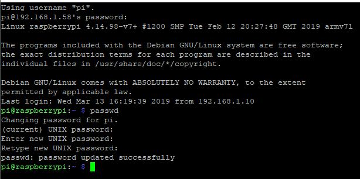

# Raspberry Pi setup for running python & communicating with XBees :D

## Raspbian install
1. Download system image [here](https://www.raspberrypi.org/downloads/raspbian/)
2. follow steps [here](https://www.raspberrypi.org/documentation/installation/installing-images/) to flash to SD card.
3. Done'd!

We have a couple of options on how to connect to the RasPi to get a hold of its command line:
- Connect a display and a keyboard
- Connect to PC using ethernet cable between computers (This is probably the easiest way)
- Connect the device to a network and SSH in using PuTTY, for example. Look up the IP the device gets either from a connected display (IP shown during bootup) or from a router the RPi is connected to. The default port used for SSH is 22.

- Use the GPIO pins to use serial communication through USB, with PuTTY, for example.

The default username is **pi** and the default password is **raspberry**. You probably want to change at least the password. This can be done with the command `passwd`.

